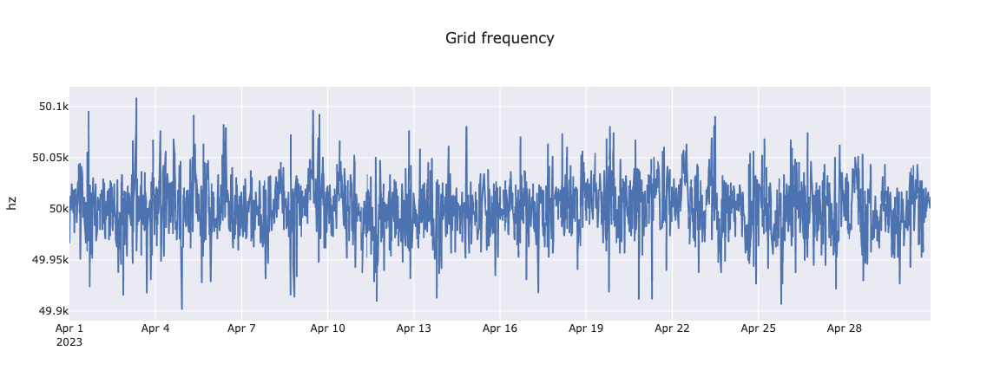

# Getting started with energy data

This repo contains jupyter notebooks for getting started with energy data, using the M5Bat grid battery dataset as an example. You can jump in and run the notebooks using colab here:
*  System-level intro
*  Individual battery intro

## Data details
The [M5Bat dataset](https://publications.rwth-aachen.de/record/985923) contains a month of operational data from 10 batteries on the grid in Aachen (Germany). It is part of the [M5Bat project](https://batteryinnovation.org/m5bat-aachen-germany/) led by RWTH Aachen University, which studies the integration of battery technologies on the electricity market.

The 10 batteries have a total capacity of 7.8 MWh (think ~ 100 Teslas) and have a single connection to the grid. They are used (in this dataset) for *frequency containment reserve* — basically to provide bursts of extra power when needed to balance the grid.

In these notebooks, we'll work with this data to get an ground-level view of how batteries operate on the grid. We’ll segment and breakdown the usage of each battery individually, visualize it, and connect it to the operation of the interconnection.

---
Contact Lawrence Cayton with questions or comments.